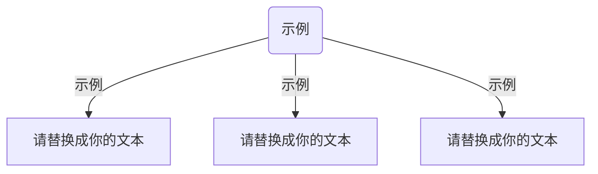

# 📖 [在此输入教程分类标题]

> 💡 **模板说明**：这是一个专为长篇教程、学术笔记设计的汇总页面。请根据你的实际项目（如：量化模型、语言学实验）修改下方的占位符内容。

这里人工筛选了 [项目名称] 最值得阅读的第三方资源与参考文档，涵盖从基础入门到进阶实战。

---

### 🌟 入门首选 (必读)

#### [站点/资源名称，如：官方文档中心]
[👉 点击访问资源链接](https://example.com)

> *💡 提示：在这里用一句话描述该资源的核心价值，例如：该文档由官方维护，适合零基础用户快速建立概念。*

* **[资源名称 A]** —— **[核心评价]**，例如：内容最权威，但更新频率较低。
* **[资源名称 B]** —— **[核心评价]**，例如：视频演示最直观，手把手教你完成环境配置。

---

### 🛠️ 进阶实战 / 深度研究
> 适合已掌握基础，需要处理复杂场景（如：混合效应模型调试、高级爬虫开发）的用户。

* **[进阶课题 01]** —— [方案简述]，例如：低成本实现方案，教你如何在 10 分钟内跑通流程。
* **[进阶课题 02]** —— [方案简述]，例如：针对大数据集的性能优化指南。

---

### 📂 相关附件与工具
* [工具名称 / 插件下载](https://example.com)
* [原始数据集 / 语料库说明](https://example.com)

---

::: tip 快速更新指南
如果你发现了更好的教程或资源，欢迎通过 GitHub 提交 Pull Request 或直接联系作者！
:::