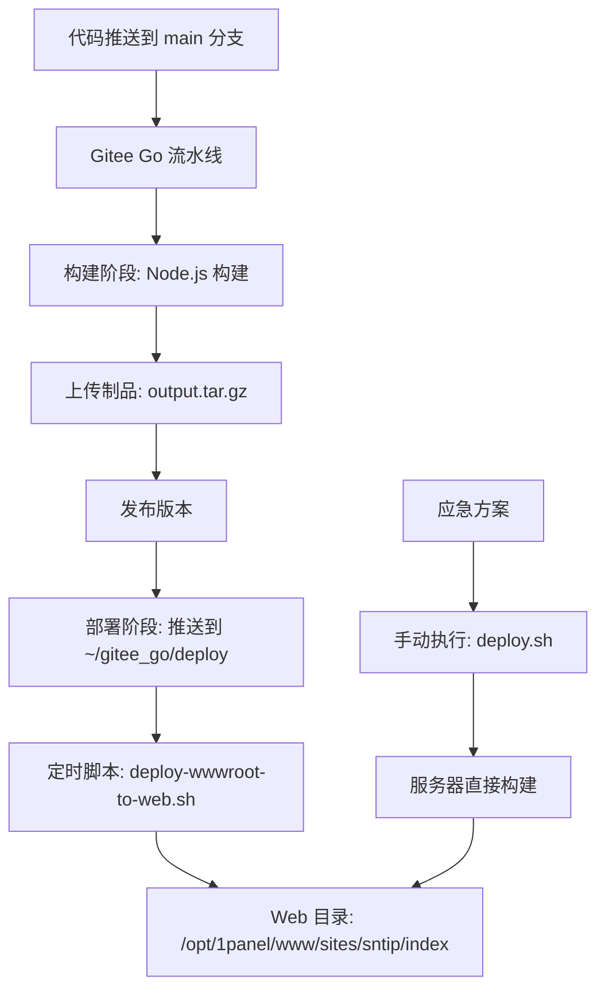

# Gitee Go 部署方案实操文档

针对实际部署中的问题，优化配置，使用以下方案

## 📋 部署架构概述

本项目采用**三层部署架构**,平衡 CI/CD 自动化与服务器资源压力:



**核心流程**:
1. **Gitee Go 流水线**: 完成构建、打包制品、推送到服务器 `~/gitee_go/deploy` 目录
2. **自动解压脚本**: `deploy-wwwroot-to-web.sh` 定时检测并解压制品到 Web 目录
3. **应急部署脚本**: `deploy.sh` 用于流水线失败时手动在服务器构建

**设计原因**:
- 轻量应用服务器(2核2G)直接在流水线构建常失败
- 分离制品推送与实际部署,降低流水线复杂度
- 定时脚本实现智能对比,只在文件变动时部署

---

## 🚀 方案一: Gitee Go 流水线 + 定时解压(主方案)

### 1.1 流水线配置

流水线完成**构建 → 上传制品 → 发布版本 → 部署制品到服务器**四个阶段。

**关键配置**:
- **构建环境**: Gitee Go 云服务器(Node.js 25.4.0)
- **制品格式**: `output.tar.gz`(包含 `docs/.vitepress/dist` 全部内容)
- **部署目标**: `~/gitee_go/deploy/output.tar.gz`
- **触发条件**: main 分支自动触发

**完整流水线代码**(`.workflow/main-gitee.yml`):

```yaml
version: '1.0'
name: main-gitee
displayName: main-gitee
triggers:
  trigger: auto
  push:
    branches:
      prefix:
        - main
stages:
  - name: stage-build
    displayName: 构建
    strategy: naturally
    trigger: auto
    steps:
      - step: build@nodejs
        name: build-nodejs
        displayName: Node.js 构建
        nodeVersion: 25.4.0
        commands:
          - npm config set registry https://registry.npmmirror.com
          - npm ci
          - npm run docs:build
          - cd docs/.vitepress/dist && tar -czf ../../../output.tar.gz .
        artifacts:
          - name: BUILD_ARTIFACT
            path:
              - output.tar.gz
  - name: stage-upload
    displayName: 上传制品
    strategy: naturally
    trigger: auto
    steps:
      - step: publish@general_artifacts
        name: publish_general_artifacts
        displayName: 上传制品
        dependArtifact: BUILD_ARTIFACT
        artifactName: output
        notify: []
        strategy:
          retry: '0'
  - name: stage-release
    displayName: 发布版本
    strategy: naturally
    trigger: auto
    steps:
      - step: publish@release_artifacts
        name: publish_release_artifacts
        displayName: 发布
        dependArtifact: output
        version: 1.0.0.0
        autoIncrement: true
        notify: []
        strategy:
          retry: '0'
  - name: stage-deploy
    displayName: 部署
    strategy: naturally
    trigger: auto
    steps:
      - step: deploy@agent
        name: deploy_agent
        displayName: 部署到服务器
        hostGroupID:
          ID: ali2026
          hostID:
            - c2a096df-4e33-455b-96ec-b183130b69b4
        deployArtifact:
          - source: artifact
            name: output
            target: ~/gitee_go/deploy
            artifactRepository: release
            artifactName: output
            artifactVersion: latest
        script:
          - mkdir -p /opt/wwwroot
          - tar -xzf ~/gitee_go/deploy/output.tar.gz -C /opt/wwwroot
          - chmod -R 755 /opt/wwwroot
        strategy: {}
```

**流水线说明**:
- **构建阶段**: 在 Gitee Go 云服务器完成 `npm ci` 和 `npm run docs:build`
- **部署阶段**: 只推送制品压缩包到 `~/gitee_go/deploy`,不执行解压操作
- **优势**: 减轻本地服务器构建压力,避免 2核2G 服务器内存不足导致构建失败

---

### 1.2 自动解压脚本

**脚本文件**: `deploy-wwwroot-to-web.sh`

**核心功能**:
- 定时检测 `/opt/wwwroot/output.tar.gz` 是否存在
- 智能处理嵌套制品包（自动二次解压）
- 解压到临时目录，通过 MD5 对比判断文件是否变动
- 仅在文件变动时执行部署，避免无效操作
- 自动备份旧版本（保留最近 5 个备份，正则匹配防误删）
- 规范化权限设置（目录 755、文件 644）

**目录说明**:
- **源文件**: `/opt/wwwroot/output.tar.gz`(流水线推送)
- **目标目录**: `/opt/1panel/www/sites/sntip/index`(Web 访问目录)
- **临时目录**: `/tmp/deploy_cs.XXXXXX`(使用 mktemp 创建，执行后自动清理)

**关键优化记录**:
- ✅ **BOM 字符修复**: 确保文件使用 UTF-8 无 BOM 编码，shebang 正确识别
- ✅ **环境变量防护**: 使用 `id -un` 替代 `whoami`，在 `set -eu` 前初始化 HOME 和 USER
- ✅ **临时文件安全**: 使用 `mktemp -d` 创建唯一临时目录，避免 PID 冲突和资源泄漏
- ✅ **MD5 性能优化**: `find -exec md5sum {} +` 替代 `\;`，批量处理提升性能
- ✅ **权限规范化**: 目录 755、文件 644，替代不安全的 `chmod -R 755`
- ✅ **嵌套制品处理**: 自动检测并二次解压 Gitee Go 产生的嵌套 `artifact_*.tar.gz`
- ✅ **备份安全增强**: 增加正则匹配防止误删非备份目录

**完整脚本代码**:

```sh
#!/bin/bash
# ============================================================================
# 条件部署脚本：将流水线制品解压到 1Panel 站点目录
# 用法：bash deploy-wwwroot-to-web.sh
# 逻辑：
#   1. 检测 /opt/wwwroot/output.tar.gz 是否存在
#   2. 解压到临时目录
#   3. 对比临时目录与目标目录差异
#   4. 有变动才执行部署
# ============================================================================

# 确保 HOME 和 USER 环境变量存在（必须在 set -eu 之前）
if [ -z "${HOME:-}" ]; then
    HOME=$(eval echo "~$(id -un)")
    export HOME
fi
if [ -z "${USER:-}" ]; then
    USER=$(id -un)
    export USER
fi

set -eu

SOURCE_TAR="/opt/wwwroot/output.tar.gz"
TARGET_DIR="/opt/1panel/www/sites/sntip/index"
TEMP_DIR=$(mktemp -d /tmp/deploy_cs.XXXXXX)
EXTRACT_DIR="$TEMP_DIR/extract"

# 将临时文件放入 TEMP_DIR 内部，确保 cleanup 能一次性清理
TAR_ERR_FILE="$TEMP_DIR/tar_err.log"
MD5_SRC_FILE="$TEMP_DIR/source.md5"
MD5_TGT_FILE="$TEMP_DIR/target.md5"

# -------------------- 颜色输出 --------------------
RED='\033[0;31m'
GREEN='\033[0;32m'
YELLOW='\033[1;33m'
BLUE='\033[0;34m'
NC='\033[0m'

log_info()  { echo -e "${BLUE}[INFO]${NC}  $1"; }
log_ok()    { echo -e "${GREEN}[OK]${NC}    $1"; }
log_warn()  { echo -e "${YELLOW}[WARN]${NC}  $1"; }
log_error() { echo -e "${RED}[ERROR]${NC} $1"; }

# -------------------- 清理临时目录 --------------------
cleanup() {
    rm -rf "$TEMP_DIR"
}
trap cleanup EXIT

# -------------------- 检查制品文件 --------------------
if [ ! -f "$SOURCE_TAR" ]; then
    log_error "制品文件不存在: $SOURCE_TAR"
    exit 1
fi

# -------------------- 解压制品到临时目录 --------------------
log_info "解压制品: $SOURCE_TAR"
mkdir -p "$EXTRACT_DIR"

# 查看制品内容结构
log_info "制品内容列表:"
tar -tzf "$SOURCE_TAR" 2>/dev/null | head -20 || true
echo "---"

# 尝试直接解压
if ! tar -xzf "$SOURCE_TAR" -C "$EXTRACT_DIR" 2>"$TAR_ERR_FILE"; then
    log_error "制品解压失败:"
    cat "$TAR_ERR_FILE"
    exit 1
fi

# 检查是否存在嵌套的 artifact tar.gz 文件
NESTED_TAR=$(find "$EXTRACT_DIR" -name "artifact_*.tar.gz" -type f 2>/dev/null | head -1)
if [ -n "$NESTED_TAR" ]; then
    log_info "检测到嵌套制品包: $(basename "$NESTED_TAR")"
    
    # 检查文件大小和类型
    NESTED_SIZE=$(wc -c < "$NESTED_TAR" 2>/dev/null || echo 0)
    log_info "嵌套包大小: $NESTED_SIZE 字节"
    
    # 使用 file 命令检查文件类型
    if command -v file >/dev/null 2>&1; then
        NESTED_TYPE=$(file "$NESTED_TAR" 2>/dev/null || echo "unknown")
        log_info "嵌套包类型: $NESTED_TYPE"
    fi
    
    # 如果文件太小（小于100字节），可能是空包或占位符
    if [ "$NESTED_SIZE" -lt 100 ]; then
        log_warn "嵌套包过小（$NESTED_SIZE 字节），可能是空包，直接删除"
        rm -f "$NESTED_TAR"
    else
        log_info "正在二次解压..."
        
        # 创建二次解压目录
        NESTED_DIR="$TEMP_DIR/nested"
        mkdir -p "$NESTED_DIR"
        
        # 查看嵌套包内容
        log_info "嵌套包内容列表:"
        if ! tar -tzf "$NESTED_TAR" 2>/tmp/tar_list_error.txt | head -20; then
            log_warn "无法列出嵌套包内容:"
            cat /tmp/tar_list_error.txt 2>/dev/null || true
        fi
        echo "---"
        
        # 尝试二次解压
        if tar -xzf "$NESTED_TAR" -C "$NESTED_DIR" 2>"$TAR_ERR_FILE"; then
            # 二次解压成功，用内层内容替换
            NESTED_FILES=$(find "$NESTED_DIR" -type f 2>/dev/null | wc -l)
            if [ "$NESTED_FILES" -gt 0 ]; then
                # 彻底清空 EXTRACT_DIR 并重新创建
                rm -rf "$EXTRACT_DIR"
                mkdir -p "$EXTRACT_DIR"
                cp -a "$NESTED_DIR/." "$EXTRACT_DIR/"
                log_info "二次解压成功，获得 $NESTED_FILES 个文件"
            else
                log_error "二次解压后目录为空"
                exit 1
            fi
        else
            log_error "嵌套包解压失败:"
            cat "$TAR_ERR_FILE" 2>/dev/null || true
            log_warn "删除损坏的嵌套包，保留其他解压内容"
            rm -f "$NESTED_TAR"
        fi
    fi
fi

SOURCE_FILE_COUNT=$(find "$EXTRACT_DIR" -type f 2>/dev/null | wc -l)
if [ "$SOURCE_FILE_COUNT" -eq 0 ]; then
    log_error "制品解压后为空"
    exit 1
fi
log_info "制品文件数: $SOURCE_FILE_COUNT"

# -------------------- 确保目标目录存在 --------------------
mkdir -p "$TARGET_DIR"

# -------------------- 对比文件差异 --------------------
log_info "正在对比源与目标目录..."

# 生成解压目录文件清单（含 MD5），使用 + 提升性能
cd "$EXTRACT_DIR"
find . -type f -exec md5sum {} + 2>/dev/null | sort > "$MD5_SRC_FILE" || true

# 生成目标目录文件清单（含 MD5），使用 + 提升性能
cd "$TARGET_DIR"
TARGET_FILE_COUNT=$(find . -type f 2>/dev/null | wc -l)
if [ "$TARGET_FILE_COUNT" -eq 0 ]; then
    log_warn "目标目录为空，将执行首次部署..."
    > "$MD5_TGT_FILE"
else
    find . -type f -exec md5sum {} + 2>/dev/null | sort > "$MD5_TGT_FILE" || true
fi

# 对比差异
DIFF_OUTPUT=$(diff "$MD5_SRC_FILE" "$MD5_TGT_FILE" 2>/dev/null) || true

if [ -z "$DIFF_OUTPUT" ]; then
    log_ok "目标目录已是最新，无需部署。"
    exit 0
fi

# -------------------- 显示变动摘要 --------------------
ADDED=$(echo "$DIFF_OUTPUT" | grep -c "^< " 2>/dev/null || true)
REMOVED=$(echo "$DIFF_OUTPUT" | grep -c "^> " 2>/dev/null || true)

log_warn "检测到文件变动（新增: $ADDED, 删除: $REMOVED）"

# 显示前20行差异
echo "$DIFF_OUTPUT" | head -20
DIFF_LINES=$(echo "$DIFF_OUTPUT" | wc -l)
if [ "$DIFF_LINES" -gt 20 ]; then
    echo "... (共 $DIFF_LINES 行差异，仅显示前 20 行)"
fi

# -------------------- 执行部署 --------------------
log_info "开始部署..."

# 备份旧版本（仅保留最近5个）
if [ "$TARGET_FILE_COUNT" -gt 0 ]; then
    BACKUP_DIR="${TARGET_DIR}_backup_$(date +%Y%m%d_%H%M%S)"
    cp -a "$TARGET_DIR" "$BACKUP_DIR"
    log_info "已备份到: $BACKUP_DIR"

    # 清理超出5个的旧备份（增加正则匹配避免误删）
    OLD_BACKUPS=$(ls -1dr "${TARGET_DIR}_backup_"* 2>/dev/null | grep -E "${TARGET_DIR}_backup_[0-9]{8}_[0-9]{6}$" | tail -n +6 || true)
    if [ -n "$OLD_BACKUPS" ]; then
        echo "$OLD_BACKUPS" | xargs rm -rf
        log_info "已清理旧备份，保留最近5个"
    fi
fi

# 清空目标目录（保留隐藏文件如 .user.ini）
find "$TARGET_DIR" -mindepth 1 -not -name '.*' -delete 2>/dev/null || true

# 复制解压后的文件到目标
cp -a "$EXTRACT_DIR/." "$TARGET_DIR/"

# 设置规范化权限
log_info "正在设置目录与文件权限..."
find "$TARGET_DIR" -type d -exec chmod 755 {} +
find "$TARGET_DIR" -type f -exec chmod 644 {} +

log_ok "部署完成 → $TARGET_DIR"
```

**定时任务配置**:

在服务器 crontab 中配置每 3 分钟执行一次:

```bash
# 编辑定时任务
crontab -e

# 添加以下内容(每 3 分钟执行一次)
*/3 * * * * /bin/bash /path/to/deploy-wwwroot-to-web.sh >> /var/log/deploy-wwwroot.log 2>&1
```

---

## 🔧 方案二: 手动应急部署(备用方案)

当 Gitee Go 流水线失败或需要紧急修复时,使用此方案直接在服务器构建。

**脚本文件**: `deploy.sh`

**核心功能**:
- 在 `/opt/wwwroot` 目录拉取最新代码
- 安装依赖并构建 VitePress 项目
- 自动备份旧版本,部署到 Web 目录
- 支持版本回滚(`--rollback` 参数)

**目录说明**:
- **代码目录**: `/opt/wwwroot`(Git 仓库拉取位置)
- **构建产物**: `/opt/wwwroot/docs/.vitepress/dist`
- **Web 目录**: `/opt/1panel/www/sites/sntip/index`

**使用方式**:

```bash
# 完整部署(拉取 + 构建 + 部署)
bash deploy.sh

# 回滚到上一版本
bash deploy.sh --rollback

# 查看帮助
bash deploy.sh --help
```

**完整脚本代码**:

```sh
#!/bin/bash
# ============================================================================
# VitePress 知行笔记 - 应急部署脚本
# 用途:当 Gitee Go 流水线失败时的应急方案
# 功能:在服务器上直接拉取代码 → 构建 → 部署到 Web 目录
# ============================================================================

set -eu

# -------------------- 配置区 --------------------
PROJECT_DIR="/opt/wwwroot"
GIT_REPO="https://gitee.com/shub77/vitepress-tip.git"
GIT_BRANCH="main"
DIST_DIR="$PROJECT_DIR/docs/.vitepress/dist"
WEB_DIR="/opt/1panel/www/sites/sntip/index"
NPM_REGISTRY="https://registry.npmmirror.com"
MAX_BACKUPS=5

# -------------------- 颜色输出 --------------------
RED='\033[0;31m'
GREEN='\033[0;32m'
YELLOW='\033[1;33m'
BLUE='\033[0;34m'
NC='\033[0m'

log_info()  { echo -e "${BLUE}[INFO]${NC}  $1"; }
log_ok()    { echo -e "${GREEN}[OK]${NC}    $1"; }
log_warn()  { echo -e "${YELLOW}[WARN]${NC}  $1"; }
log_error() { echo -e "${RED}[ERROR]${NC} $1"; }

# -------------------- 函数:环境检查 --------------------
check_environment() {
    log_info "检查服务器环境..."
    
    local required_cmds=(git npm node)
    for cmd in "${required_cmds[@]}"; do
        if ! command -v "$cmd" &>/dev/null; then
            log_error "缺少必要命令: $cmd"
            exit 1
        fi
    done
    
    local current_node_version
    current_node_version=$(node -v | sed 's/^v//')
    log_info "当前 Node.js 版本: $current_node_version"
    
    local available_space
    available_space=$(df -m "$PROJECT_DIR" 2>/dev/null | awk 'NR==2 {print $4}' || echo "0")
    if [ "$available_space" -lt 500 ]; then
        log_error "磁盘空间不足: ${available_space}MB (至少需要 500MB)"
        exit 1
    fi
    
    log_ok "环境检查通过 (可用空间: ${available_space}MB)"
}

# -------------------- 函数:拉取最新代码 --------------------
pull_latest() {
    log_info "拉取最新代码到 $PROJECT_DIR ..."
    
    if [ ! -d "$PROJECT_DIR/.git" ]; then
        log_info "目录不是 Git 仓库,准备克隆..."
        
        if [ -d "$PROJECT_DIR" ] && [ "$(ls -A "$PROJECT_DIR" 2>/dev/null)" ]; then
            log_warn "$PROJECT_DIR 已存在且不为空,将备份后重新克隆"
            BACKUP_SRC="${PROJECT_DIR}_backup_src_$(date +%Y%m%d_%H%M%S)"
            mv "$PROJECT_DIR" "$BACKUP_SRC"
            log_info "已备份原目录到: $BACKUP_SRC"
        fi
        
        mkdir -p "$PROJECT_DIR"
        git clone "$GIT_REPO" "$PROJECT_DIR"
        log_ok "仓库克隆完成"
    else
        cd "$PROJECT_DIR"
        git stash 2>/dev/null || true
        git fetch origin
        git reset --hard "origin/$GIT_BRANCH"
    fi
    
    log_ok "代码已更新到最新 commit: $(cd "$PROJECT_DIR" && git rev-parse --short HEAD)"
}

# -------------------- 函数:构建项目 --------------------
build_project() {
    log_info "安装依赖并构建 VitePress..."
    
    cd "$PROJECT_DIR"
    npm config set registry "$NPM_REGISTRY"
    npm ci --prefer-offline --no-audit
    npm run docs:build
    
    log_ok "构建完成 → $DIST_DIR"
}

# -------------------- 函数:验证构建产物 --------------------
verify_build() {
    log_info "验证构建产物完整性..."
    
    if [ ! -d "$DIST_DIR" ]; then
        log_error "构建产物目录不存在: $DIST_DIR"
        return 1
    fi
    
    local required_files=("index.html" "assets" "404.html")
    for file in "${required_files[@]}"; do
        if [ ! -e "$DIST_DIR/$file" ]; then
            log_error "缺少关键文件/目录: $file"
            return 1
        fi
    done
    
    local total_size
    total_size=$(du -sm "$DIST_DIR" | awk '{print $1}')
    if [ "$total_size" -lt 1 ]; then
        log_error "构建产物过小: ${total_size}MB"
        return 1
    fi
    
    local file_count
    file_count=$(find "$DIST_DIR" -type f | wc -l)
    
    log_ok "构建产物验证通过 (${total_size}MB, $file_count 个文件)"
    return 0
}

# -------------------- 函数:部署到 Web 目录 --------------------
deploy_to_web() {
    log_info "部署到 Web 目录: $WEB_DIR"
    
    mkdir -p "$WEB_DIR"
    
    if [ "$(ls -A "$WEB_DIR" 2>/dev/null)" ]; then
        BACKUP_DIR="${WEB_DIR}_backup_$(date +%Y%m%d_%H%M%S)"
        cp -a "$WEB_DIR" "$BACKUP_DIR"
        log_info "已备份旧版本到: $BACKUP_DIR"
        
        OLD_BACKUPS=$(ls -1dr "${WEB_DIR}_backup_"* 2>/dev/null | tail -n +$((MAX_BACKUPS + 1)) || true)
        if [ -n "$OLD_BACKUPS" ]; then
            echo "$OLD_BACKUPS" | xargs rm -rf
            log_info "已清理旧备份,保留最近 $MAX_BACKUPS 个"
        fi
    fi
    
    find "$WEB_DIR" -mindepth 1 -not -name '.*' -delete 2>/dev/null || true
    cp -a "$DIST_DIR/." "$WEB_DIR/"
    chmod -R 755 "$WEB_DIR"
    
    local file_count
    file_count=$(find "$WEB_DIR" -type f | wc -l)
    
    log_ok "部署完成 → $WEB_DIR ($file_count 个文件)"
}

# -------------------- 函数:回滚 --------------------
rollback_deploy() {
    echo ""
    echo "╔══════════════════════════════════════════════╗"
    echo "║     回滚到上一版本                           ║"
    echo "╚══════════════════════════════════════════════╝"
    echo ""
    
    local LATEST_BACKUP
    LATEST_BACKUP=$(ls -dt "${WEB_DIR}_backup_"* 2>/dev/null | head -n 1)
    
    if [ -z "$LATEST_BACKUP" ] || [ ! -d "$LATEST_BACKUP" ]; then
        log_error "未找到可用的备份版本"
        exit 1
    fi
    
    log_info "最新备份: $LATEST_BACKUP"
    read -p "确认回滚到此版本? (y/N): " confirm
    
    if [[ ! "$confirm" =~ ^[Yy]$ ]]; then
        log_info "已取消回滚"
        exit 0
    fi
    
    local CURRENT_BACKUP="${WEB_DIR}_backup_current_$(date +%Y%m%d_%H%M%S)"
    if [ "$(ls -A "$WEB_DIR" 2>/dev/null)" ]; then
        cp -a "$WEB_DIR" "$CURRENT_BACKUP"
        log_info "已备份当前版本到: $CURRENT_BACKUP"
    fi
    
    log_info "恢复备份到 $WEB_DIR ..."
    find "$WEB_DIR" -mindepth 1 -not -name '.*' -delete 2>/dev/null || true
    cp -a "$LATEST_BACKUP/." "$WEB_DIR/"
    chmod -R 755 "$WEB_DIR"
    
    local file_count
    file_count=$(find "$WEB_DIR" -type f | wc -l)
    
    log_ok "🎉 回滚完成!站点已恢复到备份版本 ($file_count 个文件)"
    log_info "Web 目录: $WEB_DIR"
    echo ""
}

# -------------------- 入口 --------------------
case "${1:-}" in
    --rollback)
        rollback_deploy
        ;;
    --help|-h)
        echo "用法: bash deploy.sh [选项]"
        echo ""
        echo "选项:"
        echo "  (无参数)       完整部署:拉取代码 → 构建 → 部署到 Web 目录"
        echo "  --rollback     回滚到上一版本(从备份恢复)"
        echo "  --help         显示此帮助"
        ;;
    *)
        check_environment
        pull_latest
        build_project
        
        if ! verify_build; then
            log_error "构建产物验证失败,中止部署"
            exit 1
        fi
        
        deploy_to_web
        
        local END_TIME=$(date +%s)
        log_ok "🎉 全部完成!"
        log_info "代码目录: $PROJECT_DIR"
        log_info "Web 目录: $WEB_DIR"
        ;;
esac
```

---

## 📊 两种方案对比

| 对比项 | 方案一: 流水线 + 定时脚本 | 方案二: 手动应急部署 |
|--------|--------------------------|----------------------|
| **使用场景** | 日常自动部署 | 流水线失败时的应急方案 |
| **构建位置** | Gitee Go 云服务器 | 本地服务器 `/opt/wwwroot` |
| **触发方式** | 代码推送自动触发 + 定时任务 | 手动执行 `bash deploy.sh` |
| **服务器压力** | 低(只接收制品压缩包) | 高(需要安装依赖和构建) |
| **部署速度** | 快(3分钟内自动检测部署) | 较慢(需完整构建流程) |
| **资源要求** | 低(只需解压和文件对比) | 高(需要 Node.js 和足够内存) |
| **自动化程度** | 全自动 | 手动 |
| **回滚支持** | 手动恢复备份 | 支持 `--rollback` 参数 |
| **适用服务器** | 所有配置(包括2核2G) | 建议4核以上服务器 |

## 💡 使用建议

### 日常开发
- 直接推送到 `main` 分支,流水线自动构建
- 定时脚本自动检测并部署新版本
- 无需人工干预

### 应急场景
1. **流水线构建失败**:
   - 检查 Gitee Go 构建日志
   - 确认失败原因(通常是内存不足)
   - SSH 登录服务器执行 `bash deploy.sh`

2. **新版本有问题**:
   - 快速回滚: `bash deploy.sh --rollback`
   - 检查并修复代码后重新推送

3. **首次部署**:
   - 推荐使用方案一(流水线)
   - 如服务器配置足够(4核8G以上),可使用方案二

## 🔍 常见问题

**Q1: 为什么不在流水线中直接解压部署?**
- 流水线部署步骤权限受限,无法直接操作 Web 目录
- 分离后更灵活,可独立控制部署时机

**Q2: 定时脚本的执行间隔是多久?**
- 建议 3 分钟,可根据实际需求调整 crontab
- 脚本使用 MD5 对比,无变动时秒级退出

**Q3: 两种方案可以同时使用吗?**
- 可以,但建议以方案一为主,方案二为辅
- 避免同时执行导致文件冲突

**Q4: 如何查看部署日志?**
- 定时脚本: `tail -f /var/log/deploy-wwwroot.log`
- 应急脚本: 直接查看终端输出
- 流水线: Gitee Go 控制台查看构建日志

**Q5: 备份文件占用空间过大怎么办?**
- 脚本自动保留最近 5 个备份
- 手动清理: `ls -dt /opt/1panel/www/sites/sntip/index_backup_* | tail -n +6 | xargs rm -rf`

**Q6: 定时脚本报错 `HOME: unbound variable` 或 `#!/bin/bash: No such file or directory`?**
- **原因 1**: `set -eu` 模式下,cron 环境可能没有定义 `$HOME` 变量
  - **解决**: 在 `set -eu` 之前添加 HOME 检查:`if [ -z "${HOME:-}" ]; then HOME=$(eval echo "~$(whoami)"); export HOME; fi`
- **原因 2**: 文件包含 UTF-8 BOM 字符,导致 shebang 无法识别
  - **解决**: 使用 UTF-8 无 BOM 编码保存文件,LF 换行符
- **原因 3**: 文件使用 CRLF 换行符(Windows 格式)
  - **解决**: 转换为 LF 换行符:`dos2unix deploy-wwwroot-to-web.sh`
