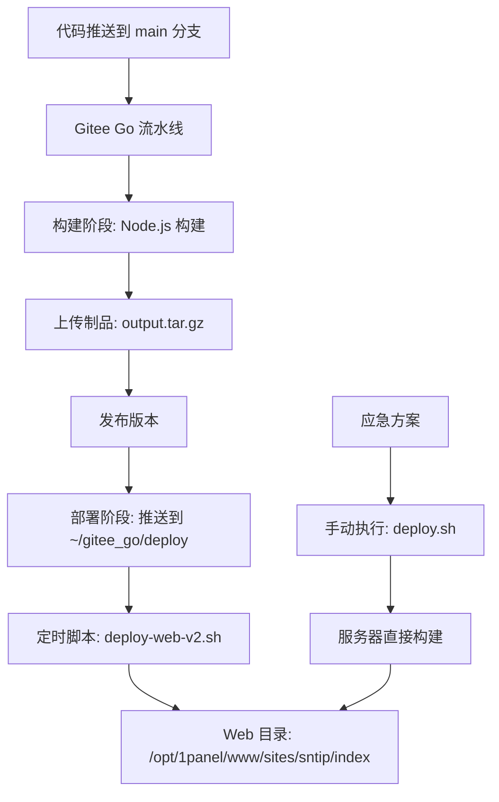

# Gitee Go 部署方案实操文档 V2

针对实际部署中的问题，优化配置，使用以下优化方案

## 📋 部署架构概述

本项目采用**三层部署架构**,平衡 CI/CD 自动化与服务器资源压力:



**核心流程**:
1. **Gitee Go 流水线**: 完成构建、打包制品、推送到服务器 `~/gitee_go/deploy` 目录
2. **自动解压脚本**: `deploy-web-v2.sh` 定时检测并解压制品到 Web 目录
3. **应急部署脚本**: `deploy.sh` 用于流水线失败时手动在服务器构建

**设计原因**:
- 轻量应用服务器(2核2G)直接在流水线构建常失败
- 分离制品推送与实际部署,降低流水线复杂度
- 定时脚本实现智能对比,只在文件变动时部署

---

## 🚀 方案一: Gitee Go 流水线 + 定时解压(主方案)

### 1.1 流水线配置

流水线完成**构建 → 上传制品 → 发布版本 → 部署制品到服务器**四个阶段。

**关键配置**:
- **构建环境**: Gitee Go 云服务器(Node.js 25.4.0)
- **制品格式**: `output.tar.gz`(包含 `docs/.vitepress/dist` 全部内容)
- **部署目标**: `~/gitee_go/deploy/output.tar.gz`
- **触发条件**: main 分支自动触发

**完整流水线代码**(`.workflow/main-gitee.yml`):
::: details 查看流水线代码
```yaml
version: '1.0'
name: main-gitee
displayName: main-gitee
triggers:
  trigger: auto
  push:
    branches:
      prefix:
        - main
stages:
  - name: stage-build
    displayName: 构建
    strategy: naturally
    trigger: auto
    steps:
      - step: build@nodejs
        name: build-nodejs
        displayName: Node.js 构建
        nodeVersion: 25.4.0
        commands:
          - npm config set registry https://registry.npmmirror.com
          - npm ci
          - npm run docs:build
          - cd docs/.vitepress/dist && tar -czf ../../../output.tar.gz .
        artifacts:
          - name: BUILD_ARTIFACT
            path:
              - output.tar.gz
  - name: stage-upload
    displayName: 上传制品
    strategy: naturally
    trigger: auto
    steps:
      - step: publish@general_artifacts
        name: publish_general_artifacts
        displayName: 上传制品
        dependArtifact: BUILD_ARTIFACT
        artifactName: output
        notify: []
        strategy:
          retry: '0'
  - name: stage-release
    displayName: 发布版本
    strategy: naturally
    trigger: auto
    steps:
      - step: publish@release_artifacts
        name: publish_release_artifacts
        displayName: 发布
        dependArtifact: output
        version: 1.0.0.0
        autoIncrement: true
        notify: []
        strategy:
          retry: '0'
  - name: stage-deploy
    displayName: 部署
    strategy: naturally
    trigger: auto
    steps:
      - step: deploy@agent
        name: deploy_agent
        displayName: 部署到服务器
        hostGroupID:
          ID: ali2026
          hostID:
            - c2a096df-4e33-455b-96ec-b183130b69b4
        deployArtifact:
          - source: artifact
            name: output
            target: ~/gitee_go/deploy
            artifactRepository: release
            artifactName: output
            artifactVersion: latest
        script:
          - echo "制品已推送到 ~/gitee_go/deploy/，等待 deploy-web-v2.sh 定时部署"
        strategy: {}
```
:::
**流水线说明**:
- **构建阶段**: 在 Gitee Go 云服务器完成 `npm ci` 和 `npm run docs:build`
- **部署阶段**: 只推送制品压缩包到 `~/gitee_go/deploy`,不执行解压操作
- **优势**: 减轻本地服务器构建压力,避免 2核2G 服务器内存不足导致构建失败

---

### 1.2 自动解压脚本

**脚本文件**: `deploy-web-v2.sh`

**核心功能**:
- 定时检测 `~/gitee_go/deploy/output.tar.gz` 是否存在
- 智能处理嵌套制品包（自动二次解压）
- 解压到临时目录，通过 MD5 对比判断文件是否变动
- 仅在文件变动时执行部署，避免无效操作
- 自动备份旧版本（保留最近 5 个备份，正则匹配防误删）
- 规范化权限设置（目录 755、文件 644）

**目录说明**:
- **源文件**: `~/gitee_go/deploy/output.tar.gz`(流水线推送)
- **目标目录**: `/opt/1panel/www/sites/sntip/index`(Web 访问目录)
- **临时目录**: `/tmp/deploy_cs.XXXXXX`(使用 mktemp 创建，执行后自动清理)

**关键优化记录**:
- ✅ **BOM 字符修复**: 确保文件使用 UTF-8 无 BOM 编码，shebang 正确识别
- ✅ **环境变量防护**: 使用 `id -un` 替代 `whoami`，在 `set -eu` 前初始化 HOME 和 USER
- ✅ **临时文件安全**: 使用 `mktemp -d` 创建唯一临时目录，避免 PID 冲突和资源泄漏
- ✅ **MD5 性能优化**: `find -exec md5sum {} +` 替代 `\;`，批量处理提升性能
- ✅ **权限规范化**: 目录 755、文件 644，替代不安全的 `chmod -R 755`
- ✅ **嵌套制品处理**: 自动检测并二次解压 Gitee Go 产生的嵌套 `artifact_*.tar.gz`
- ✅ **备份安全增强**: 增加正则匹配防止误删非备份目录

**完整脚本代码**:
::: details 查看解压部署代码
```sh
#!/bin/bash
# ============================================================================
# deploy-web-v2.sh — Gitee Go 制品条件部署脚本（v2 优化版）
# ============================================================================
# 用法：
#   bash deploy-web-v2.sh              # 默认：检测制品 → 对比 → 条件部署
#   bash deploy-web-v2.sh --force       # 强制部署，跳过 MD5 对比
#   bash deploy-web-v2.sh --dry-run     # 仅对比，不执行实际部署
#   bash deploy-web-v2.sh --rollback    # 回滚到上一备份版本
#   bash deploy-web-v2.sh --status      # 查看当前部署状态
#   bash deploy-web-v2.sh --help        # 显示帮助
# ============================================================================
# 架构说明：
#   Gitee Go 流水线 → 构建并打包 output.tar.gz
#                    → deploy@agent 推送到 ~/gitee_go/deploy/
#                    → 本脚本定时检测 → 智能对比 → 条件部署到 Web 目录
# ============================================================================

# -------------------- 确保 HOME 和 USER 环境变量（必须在 set -eu 之前） --------------------
if [ -z "${HOME:-}" ]; then
    HOME=$(eval echo "~$(id -un)")
    export HOME
fi
if [ -z "${USER:-}" ]; then
    USER=$(id -un)
    export USER
fi

set -euo pipefail

# ======================== 配置区 ========================
# 制品来源目录（Gitee Go deploy@agent 推送目标）
DEPLOY_SRC_DIR="${DEPLOY_SRC_DIR:-$HOME/gitee_go/deploy}"
# 制品文件名
ARTIFACT_NAME="${ARTIFACT_NAME:-output.tar.gz}"
# Web 站点目录（1Panel 站点根目录）
TARGET_DIR="${TARGET_DIR:-/opt/1panel/www/sites/sntip/index}"
# 临时解压目录模板
TEMP_TEMPLATE="${TEMP_TEMPLATE:-/tmp/deploy-v2.XXXXXX}"
# 最大备份数
MAX_BACKUPS="${MAX_BACKUPS:-5}"
# 嵌套制品最小有效字节数
NESTED_MIN_SIZE="${NESTED_MIN_SIZE:-100}"
# 部署锁文件
LOCK_FILE="${LOCK_FILE:-/tmp/deploy-v2.lock}"
# 部署日志文件
LOG_FILE="${LOG_FILE:-/var/log/deploy-v2.log}"
# 构建产物关键文件（用于完整性校验）
REQUIRED_FILES="${REQUIRED_FILES:-index.html 404.html}"
# ======================== 配置区 END ========================

# 计算制品完整路径
SOURCE_TAR="$DEPLOY_SRC_DIR/$ARTIFACT_NAME"

# -------------------- 颜色输出 --------------------
RED='\033[0;31m'
GREEN='\033[0;32m'
YELLOW='\033[1;33m'
BLUE='\033[0;34m'
CYAN='\033[0;36m'
NC='\033[0m'
BOLD='\033[1m'

# 时间戳格式
TS_FORMAT="%Y-%m-%d %H:%M:%S"

log_info()  { echo -e "${CYAN}[$(date +"$TS_FORMAT")] ${BLUE}[INFO]${NC}  $1"; }
log_ok()    { echo -e "${CYAN}[$(date +"$TS_FORMAT")] ${GREEN}[OK]${NC}    $1"; }
log_warn()  { echo -e "${CYAN}[$(date +"$TS_FORMAT")] ${YELLOW}[WARN]${NC}  $1"; }
log_error() { echo -e "${CYAN}[$(date +"$TS_FORMAT")] ${RED}[ERROR]${NC} $1"; }

# 同时输出到日志文件
log_to_file() {
    local msg
    msg="$(date +"$TS_FORMAT") $1"
    # 确保日志目录存在
    if [ -n "${LOG_FILE:-}" ]; then
        mkdir -p "$(dirname "$LOG_FILE")" 2>/dev/null || true
        echo "$msg" >> "$LOG_FILE" 2>/dev/null || true
    fi
}

log_info_f()  { log_info "$1";  log_to_file "[INFO]  $1"; }
log_ok_f()    { log_ok "$1";    log_to_file "[OK]    $1"; }
log_warn_f()  { log_warn "$1";  log_to_file "[WARN]  $1"; }
log_error_f() { log_error "$1"; log_to_file "[ERROR] $1"; }

# -------------------- 全局变量 --------------------
TEMP_DIR=""
START_TIME=""
SCRIPT_MODE="deploy"  # deploy | force | dry-run | rollback | status

# -------------------- 清理与信号处理 --------------------
cleanup() {
    local exit_code=$?
    if [ -n "${TEMP_DIR:-}" ] && [ -d "$TEMP_DIR" ]; then
        rm -rf "$TEMP_DIR"
    fi
    # 释放锁
    release_lock
    # 记录耗时
    if [ -n "${START_TIME:-}" ]; then
        local end_time elapsed
        end_time=$(date +%s)
        elapsed=$((end_time - START_TIME))
        log_info_f "脚本退出 (code=$exit_code, 耗时=${elapsed}s)"
    fi
}
trap cleanup EXIT

# 捕获信号，确保优雅退出
trap 'log_warn_f "收到中断信号，正在清理..."; exit 130' INT TERM HUP

# -------------------- 文件锁机制 --------------------
acquire_lock() {
    if [ -f "$LOCK_FILE" ]; then
        local lock_pid lock_age
        lock_pid=$(cat "$LOCK_FILE" 2>/dev/null || echo "unknown")
        lock_age=$(($(date +%s) - $(stat -c %Y "$LOCK_FILE" 2>/dev/null || echo 0)))

        # 如果锁超过 10 分钟，视为残留锁，强制清除
        if [ "$lock_age" -gt 600 ]; then
            log_warn_f "检测到残留锁 (PID=$lock_pid, 已存在 ${lock_age}s)，强制清除"
            rm -f "$LOCK_FILE"
        else
            log_error_f "另一个部署实例正在运行 (PID=$lock_pid, 已运行 ${lock_age}s)"
            log_error_f "如果确认无其他实例，请手动删除: rm -f $LOCK_FILE"
            exit 1
        fi
    fi

    echo $$ > "$LOCK_FILE"
    log_info_f "已获取部署锁 (PID=$$)"
}

release_lock() {
    if [ -f "$LOCK_FILE" ]; then
        local lock_pid
        lock_pid=$(cat "$LOCK_FILE" 2>/dev/null || echo "")
        if [ "$lock_pid" = "$$" ]; then
            rm -f "$LOCK_FILE"
            log_info_f "已释放部署锁"
        fi
    fi
}

# -------------------- 查看部署状态 --------------------
show_status() {
    echo ""
    echo -e "${BOLD}╔══════════════════════════════════════════════╗${NC}"
    echo -e "${BOLD}║         部署状态检查                         ║${NC}"
    echo -e "${BOLD}╚══════════════════════════════════════════════╝${NC}"
    echo ""

    # 制品信息
    echo -e "${CYAN}[制品源]${NC}"
    if [ -f "$SOURCE_TAR" ]; then
        local fsize fmtime
        fsize=$(du -sh "$SOURCE_TAR" 2>/dev/null | awk '{print $1}')
        fmtime=$(stat -c '%y' "$SOURCE_TAR" 2>/dev/null | cut -d'.' -f1 || echo "unknown")
        echo "  文件: $SOURCE_TAR"
        echo "  大小: $fsize"
        echo "  修改: $fmtime"
    else
        echo -e "  ${RED}制品文件不存在: $SOURCE_TAR${NC}"
    fi
    echo ""

    # 目标目录信息
    echo -e "${CYAN}[站点目录]${NC}"
    if [ -d "$TARGET_DIR" ]; then
        local fcount dsize
        fcount=$(find "$TARGET_DIR" -type f 2>/dev/null | wc -l)
        dsize=$(du -sh "$TARGET_DIR" 2>/dev/null | awk '{print $1}')
        echo "  目录: $TARGET_DIR"
        echo "  文件数: $fcount"
        echo "  大小: $dsize"

        # 检查关键文件
        echo "  关键文件:"
        for f in $REQUIRED_FILES; do
            if [ -e "$TARGET_DIR/$f" ]; then
                echo -e "    ${GREEN}✓${NC} $f"
            else
                echo -e "    ${RED}✗${NC} $f (缺失)"
            fi
        done
    else
        echo -e "  ${RED}站点目录不存在: $TARGET_DIR${NC}"
    fi
    echo ""

    # 备份信息
    echo -e "${CYAN}[备份列表]${NC}"
    local backup_count
    backup_count=$(ls -1dr "${TARGET_DIR}_backup_"* 2>/dev/null | grep -cE "_backup_[0-9]{8}_[0-9]{6}$" || true)
    backup_count=${backup_count:-0}
    if [ "$backup_count" -gt 0 ] 2>/dev/null; then
        ls -1drt "${TARGET_DIR}_backup_"* 2>/dev/null | grep -E "_backup_[0-9]{8}_[0-9]{6}$" | while read -r dir; do
            local bname bsize
            bname=$(basename "$dir")
            bsize=$(du -sh "$dir" 2>/dev/null | awk '{print $1}')
            echo "  $bsize  $bname"
        done
        echo "  共 $backup_count 个备份"
    else
        echo "  无备份"
    fi
    echo ""

    # 锁状态
    echo -e "${CYAN}[锁状态]${NC}"
    if [ -f "$LOCK_FILE" ]; then
        local lock_pid lock_age
        lock_pid=$(cat "$LOCK_FILE" 2>/dev/null || echo "unknown")
        lock_age=$(($(date +%s) - $(stat -c %Y "$LOCK_FILE" 2>/dev/null || echo 0)))
        echo -e "  ${YELLOW}锁定中${NC} (PID=$lock_pid, 已 ${lock_age}s)"
    else
        echo -e "  ${GREEN}未锁定${NC}"
    fi
    echo ""
}

# -------------------- 嵌套制品解压 --------------------
# 处理 Gitee Go 可能产生的嵌套 artifact 包
handle_nested_artifact() {
    local extract_dir="$1"
    local tar_err_file="$2"

    # 查找所有可能的嵌套 tar.gz（更灵活的匹配模式）
    local nested_tars
    nested_tars=$(find "$extract_dir" -name "*.tar.gz" -type f 2>/dev/null)

    if [ -z "$nested_tars" ]; then
        return 0  # 无嵌套包
    fi

    # 取第一个非空的有效嵌套包
    local found_nested=""
    while IFS= read -r nested_tar; do
        local nsize
        nsize=$(wc -c < "$nested_tar" 2>/dev/null || echo 0)

        # 过滤过小的包
        if [ "$nsize" -lt "$NESTED_MIN_SIZE" ]; then
            log_warn_f "跳过过小的嵌套包: $(basename "$nested_tar") ($nsize 字节)"
            rm -f "$nested_tar"
            continue
        fi

        # 验证是否为合法 gzip 文件
        if command -v file >/dev/null 2>&1; then
            local ntype
            ntype=$(file -b "$nested_tar" 2>/dev/null || echo "")
            case "$ntype" in
                *gzip*|*tar*)
                    found_nested="$nested_tar"
                    break
                    ;;
                *)
                    log_warn_f "跳过非压缩包文件: $(basename "$nested_tar") (类型: $ntype)"
                    rm -f "$nested_tar"
                    continue
                    ;;
            esac
        else
            # 无 file 命令时用 gzip 测试
            if gzip -t "$nested_tar" 2>/dev/null; then
                found_nested="$nested_tar"
                break
            else
                log_warn_f "跳过无效压缩包: $(basename "$nested_tar")"
                rm -f "$nested_tar"
                continue
            fi
        fi
    done <<< "$nested_tars"

    if [ -z "$found_nested" ]; then
        return 0  # 无有效嵌套包
    fi

    log_info_f "检测到嵌套制品包: $(basename "$found_nested")"
    local nsize
    nsize=$(wc -c < "$found_nested" 2>/dev/null || echo 0)
    log_info_f "嵌套包大小: $nsize 字节"

    # 创建二次解压目录（在 TEMP_DIR 内，确保 cleanup 能清理）
    local nested_dir
    nested_dir="$TEMP_DIR/nested"
    mkdir -p "$nested_dir"

    # 二次解压
    if ! tar -xzf "$found_nested" -C "$nested_dir" 2>"$tar_err_file"; then
        log_error_f "嵌套包解压失败:"
        cat "$tar_err_file" 2>/dev/null | while IFS= read -r line; do
            log_error_f "  $line"
        done
        log_warn_f "删除损坏的嵌套包，保留其他解压内容"
        rm -f "$found_nested"
        return 0
    fi

    # 验证二次解压结果
    local nested_file_count
    nested_file_count=$(find "$nested_dir" -type f 2>/dev/null | wc -l)
    if [ "$nested_file_count" -eq 0 ]; then
        log_error_f "二次解压后目录为空"
        return 1
    fi

    # 用内层内容替换外层
    rm -rf "$extract_dir"
    mkdir -p "$extract_dir"
    cp -a "$nested_dir/." "$extract_dir/"
    log_info_f "二次解压成功，获得 $nested_file_count 个文件"
    return 0
}

# -------------------- 构建产物完整性验证 --------------------
verify_artifact() {
    local extract_dir="$1"
    local file_count

    file_count=$(find "$extract_dir" -type f 2>/dev/null | wc -l)
    if [ "$file_count" -eq 0 ]; then
        log_error_f "制品解压后为空"
        return 1
    fi

    log_info_f "制品文件数: $file_count"

    # 检查关键文件
    local missing=0
    for f in $REQUIRED_FILES; do
        if [ ! -e "$extract_dir/$f" ]; then
            log_warn_f "缺少关键文件: $f"
            missing=$((missing + 1))
        fi
    done

    if [ "$missing" -gt 0 ]; then
        log_error_f "制品完整性校验失败，缺少 $missing 个关键文件"
        return 1
    fi

    # 检查制品总大小（至少 10KB）
    local total_size
    total_size=$(du -sk "$extract_dir" 2>/dev/null | awk '{print $1}')
    if [ "${total_size:-0}" -lt 10 ]; then
        log_error_f "制品总大小异常: ${total_size}KB（预期至少 10KB）"
        return 1
    fi

    log_ok_f "制品完整性验证通过 ($file_count 个文件, ${total_size}KB)"
    return 0
}

# -------------------- MD5 对比（精确统计） --------------------
compare_directories() {
    local src_dir="$1"
    local tgt_dir="$2"
    local md5_src="$3"
    local md5_tgt="$4"

    log_info_f "正在对比源与目标目录..." >&2

    # 生成源目录 MD5 清单
    (cd "$src_dir" && find . -type f -exec md5sum {} + 2>/dev/null || true) | sort > "$md5_src"

    # 生成目标目录 MD5 清单
    local tgt_file_count
    tgt_file_count=$(find "$tgt_dir" -type f 2>/dev/null | wc -l)
    if [ "$tgt_file_count" -eq 0 ]; then
        log_warn_f "目标目录为空，将执行首次部署..." >&2
        > "$md5_tgt"
        echo "0"  # 返回目标文件数
        return 0
    fi

    (cd "$tgt_dir" && find . -type f -exec md5sum {} + 2>/dev/null || true) | sort > "$md5_tgt"

    echo "$tgt_file_count"
    return 0
}

# -------------------- 精确差异统计 --------------------
analyze_diff() {
    local md5_src="$1"
    local md5_tgt="$2"

    local diff_output
    diff_output=$(diff "$md5_src" "$md5_tgt" 2>/dev/null) || true

    if [ -z "$diff_output" ]; then
        echo "0 0 0"  # 无差异
        return 1      # 表示无需部署
    fi

    # 精确统计：新增、修改、删除
    # "< " = 只在源中（新文件或修改后的文件）
    # "> " = 只在目标中（需删除的文件或修改前的文件）
    local added modified removed

    # 获取源文件列表和目标文件列表中的文件名
    local src_files tgt_files common_files
    src_files=$(awk '{print $2}' "$md5_src" | sort)
    tgt_files=$(awk '{print $2}' "$md5_tgt" | sort)

    # 新增的文件（只在源中存在）
    added=$(comm -23 <(echo "$src_files") <(echo "$tgt_files") | wc -l)

    # 删除的文件（只在目标中存在）
    removed=$(comm -13 <(echo "$src_files") <(echo "$tgt_files") | wc -l)

    # 修改的文件（两边都存在但 MD5 不同）
    common_files=$(comm -12 <(echo "$src_files") <(echo "$tgt_files"))
    modified=0
    if [ -n "$common_files" ]; then
        while IFS= read -r fname; do
            local src_md5 tgt_md5
            src_md5=$(grep -F " $fname$" "$md5_src" | awk '{print $1}')
            tgt_md5=$(grep -F " $fname$" "$md5_tgt" | awk '{print $1}')
            if [ "$src_md5" != "$tgt_md5" ]; then
                modified=$((modified + 1))
            fi
        done <<< "$common_files"
    fi

    echo "$added $modified $removed"
    return 0  # 表示有差异
}

# -------------------- 备份与清理 --------------------
backup_target() {
    local tgt_dir="$1"
    local tgt_file_count="$2"

    if [ "$tgt_file_count" -eq 0 ]; then
        return 0
    fi

    local backup_dir
    backup_dir="${tgt_dir}_backup_$(date +%Y%m%d_%H%M%S)"

    log_info_f "备份当前站点到: $(basename "$backup_dir")"
    if ! cp -a "$tgt_dir" "$backup_dir"; then
        log_error_f "备份失败，中止部署以确保安全"
        return 1
    fi
    log_ok_f "备份完成"

    # 清理超出上限的旧备份（严格正则匹配，防止误删）
    local old_backups
    old_backups=$(ls -1dr "${tgt_dir}_backup_"* 2>/dev/null \
        | grep -E "${tgt_dir}_backup_[0-9]{8}_[0-9]{6}$" \
        | tail -n +$((MAX_BACKUPS + 1)) || true)

    if [ -n "$old_backups" ]; then
        local count
        count=$(echo "$old_backups" | wc -l)
        log_info_f "清理 $count 个旧备份，保留最近 $MAX_BACKUPS 个"
        echo "$old_backups" | xargs rm -rf
    fi

    return 0
}

# -------------------- 执行部署 --------------------
do_deploy() {
    local extract_dir="$1"
    local tgt_dir="$2"

    log_info_f "开始部署..."

    # 清空目标目录（保留隐藏文件如 .user.ini）
    find "$tgt_dir" -mindepth 1 -not -name '.*' -delete 2>/dev/null || true

    # 复制文件到目标
    cp -a "$extract_dir/." "$tgt_dir/"

    # 规范化权限：目录 755、文件 644
    log_info_f "设置目录与文件权限..."
    find "$tgt_dir" -type d -exec chmod 755 {} +
    find "$tgt_dir" -type f -exec chmod 644 {} +

    # 验证部署结果
    local deploy_count
    deploy_count=$(find "$tgt_dir" -type f 2>/dev/null | wc -l)

    if [ "$deploy_count" -eq 0 ]; then
        log_error_f "部署后目标目录为空，部署可能失败"
        return 1
    fi

    log_ok_f "部署完成 → $tgt_dir ($deploy_count 个文件)"
    return 0
}

# -------------------- 回滚到上一备份 --------------------
do_rollback() {
    echo ""
    echo -e "${BOLD}╔══════════════════════════════════════════════╗${NC}"
    echo -e "${BOLD}║         回滚到上一版本                       ║${NC}"
    echo -e "${BOLD}╚══════════════════════════════════════════════╝${NC}"
    echo ""

    # 查找最新备份（严格正则匹配）
    local latest_backup
    latest_backup=$(ls -1dt "${TARGET_DIR}_backup_"* 2>/dev/null \
        | grep -E "${TARGET_DIR}_backup_[0-9]{8}_[0-9]{6}$" \
        | head -n 1 || true)

    if [ -z "$latest_backup" ] || [ ! -d "$latest_backup" ]; then
        log_error_f "未找到可用的备份版本"
        exit 1
    fi

    log_info_f "最新备份: $(basename "$latest_backup")"
    local backup_size
    backup_size=$(du -sh "$latest_backup" 2>/dev/null | awk '{print $1}')
    log_info_f "备份大小: $backup_size"

    local backup_files
    backup_files=$(find "$latest_backup" -type f 2>/dev/null | wc -l)
    log_info_f "备份文件数: $backup_files"

    # 交互确认（仅在终端中）
    if [ -t 0 ]; then
        read -rp "确认回滚到此版本? (y/N): " confirm
        if [[ ! "$confirm" =~ ^[Yy]$ ]]; then
            log_info_f "已取消回滚"
            exit 0
        fi
    else
        log_info_f "非交互模式，自动确认回滚"
    fi

    # 备份当前版本
    if [ -d "$TARGET_DIR" ] && [ "$(ls -A "$TARGET_DIR" 2>/dev/null)" ]; then
        local current_backup
        current_backup="${TARGET_DIR}_backup_current_$(date +%Y%m%d_%H%M%S)"
        cp -a "$TARGET_DIR" "$current_backup"
        log_info_f "已备份当前版本到: $(basename "$current_backup")"
    fi

    # 恢复备份
    log_info_f "恢复备份到 $TARGET_DIR ..."
    find "$TARGET_DIR" -mindepth 1 -not -name '.*' -delete 2>/dev/null || true
    cp -a "$latest_backup/." "$TARGET_DIR/"

    # 规范化权限
    find "$TARGET_DIR" -type d -exec chmod 755 {} +
    find "$TARGET_DIR" -type f -exec chmod 644 {} +

    local file_count
    file_count=$(find "$TARGET_DIR" -type f | wc -l)

    log_ok_f "回滚完成! 站点已恢复到备份版本 ($file_count 个文件)"
    echo ""
}

# -------------------- 显示帮助 --------------------
show_help() {
    echo ""
    echo -e "${BOLD}deploy-web-v2.sh${NC} — Gitee Go 制品条件部署脚本 (v2)"
    echo ""
    echo "用法: bash deploy-web-v2.sh [选项]"
    echo ""
    echo "选项:"
    echo "  (无参数)       条件部署：检测制品 → MD5对比 → 有变动才部署"
    echo "  --force        强制部署：跳过MD5对比，直接部署"
    echo "  --dry-run      模拟运行：仅对比差异，不执行实际部署"
    echo "  --rollback     回滚：恢复到最近的备份版本"
    echo "  --status       状态：查看制品、站点、备份信息"
    echo "  --help         显示此帮助"
    echo ""
    echo "环境变量（可覆盖默认配置）:"
    echo "  DEPLOY_SRC_DIR  制品来源目录  (默认: ~/gitee_go/deploy)"
    echo "  ARTIFACT_NAME   制品文件名    (默认: output.tar.gz)"
    echo "  TARGET_DIR      站点目录      (默认: /opt/1panel/www/sites/sntip/index)"
    echo "  MAX_BACKUPS     最大备份数    (默认: 5)"
    echo "  LOG_FILE        日志文件路径  (默认: /var/log/deploy-v2.log)"
    echo ""
    echo "部署架构:"
    echo "  1. Gitee Go 流水线构建并推送 output.tar.gz → ~/gitee_go/deploy/"
    echo "  2. 本脚本(cron定时)检测制品 → MD5智能对比 → 条件部署"
    echo "  3. 仅在文件变动时执行部署，无变动秒级退出"
    echo ""
    echo "定时任务配置:"
    echo "  */3 * * * * /bin/bash /path/to/deploy-web-v2.sh >> /var/log/deploy-v2.log 2>&1"
    echo ""
}

# -------------------- 主流程 --------------------
main() {
    START_TIME=$(date +%s)

    # 解析命令行参数
    case "${1:-}" in
        --force)    SCRIPT_MODE="force" ;;
        --dry-run)  SCRIPT_MODE="dry-run" ;;
        --rollback) SCRIPT_MODE="rollback" ;;
        --status)   SCRIPT_MODE="status" ;;
        --help|-h)  show_help; exit 0 ;;
        "")         SCRIPT_MODE="deploy" ;;
        *)
            log_error_f "未知参数: $1"
            show_help
            exit 1
            ;;
    esac

    # 回滚模式不需要锁和制品
    if [ "$SCRIPT_MODE" = "rollback" ]; then
        do_rollback
        exit 0
    fi

    # 状态查看模式
    if [ "$SCRIPT_MODE" = "status" ]; then
        show_status
        exit 0
    fi

    # 获取文件锁（防止并发）
    acquire_lock

    echo ""
    echo -e "${BOLD}╔══════════════════════════════════════════════╗${NC}"
    echo -e "${BOLD}║     Gitee Go 制品部署 (v2)                  ║${NC}"
    echo -e "${BOLD}║     模式: $SCRIPT_MODE                           ${NC}║"
    echo -e "${BOLD}╚══════════════════════════════════════════════╝${NC}"
    echo ""

    # -------------------- 检查制品文件 --------------------
    log_info_f "制品路径: $SOURCE_TAR"

    if [ ! -f "$SOURCE_TAR" ]; then
        log_info_f "无新制品文件: $SOURCE_TAR（等待下一次流水线推送）"
        exit 0
    fi

    local tar_size
    tar_size=$(du -sh "$SOURCE_TAR" 2>/dev/null | awk '{print $1}')
    log_ok_f "制品文件就绪 ($tar_size)"

    # -------------------- 创建临时目录 --------------------
    TEMP_DIR=$(mktemp -d "$TEMP_TEMPLATE")
    local extract_dir="$TEMP_DIR/extract"
    local tar_err_file="$TEMP_DIR/tar_err.log"
    local md5_src_file="$TEMP_DIR/source.md5"
    local md5_tgt_file="$TEMP_DIR/target.md5"

    mkdir -p "$extract_dir"

    # -------------------- 解压制品 --------------------
    log_info_f "解压制品..."

    # 预览制品内容（前15行即可）
    log_info_f "制品内容预览:"
    tar -tzf "$SOURCE_TAR" 2>/dev/null | head -15 || true
    echo "---"

    # 解压到临时目录
    if ! tar -xzf "$SOURCE_TAR" -C "$extract_dir" 2>"$tar_err_file"; then
        log_error_f "制品解压失败:"
        cat "$tar_err_file" 2>/dev/null | while IFS= read -r line; do
            log_error_f "  $line"
        done
        exit 1
    fi
    log_ok_f "制品解压完成"

    # -------------------- 处理嵌套制品 --------------------
    handle_nested_artifact "$extract_dir" "$tar_err_file"

    # -------------------- 验证制品完整性 --------------------
    if ! verify_artifact "$extract_dir"; then
        log_error_f "制品完整性验证失败，中止部署"
        exit 1
    fi

    # -------------------- 对比差异 --------------------
    local tgt_file_count
    tgt_file_count=$(compare_directories "$extract_dir" "$TARGET_DIR" "$md5_src_file" "$md5_tgt_file")

    if [ "$SCRIPT_MODE" = "force" ]; then
        log_warn_f "强制模式：跳过MD5对比，直接部署"
    else
        # 精确差异分析
        local diff_result
        diff_result=$(analyze_diff "$md5_src_file" "$md5_tgt_file")
        local has_diff=$?

        if [ "$has_diff" -ne 0 ]; then
            log_ok_f "目标目录已是最新，无需部署。"
            exit 0
        fi

        # 解析差异统计
        local added modified removed
        read -r added modified removed <<< "$diff_result"

        local total_changes=$((added + modified + removed))
        log_warn_f "检测到文件变动: 新增=$added, 修改=$modified, 删除=$removed (共 $total_changes 项)"

        # dry-run 模式到此结束
        if [ "$SCRIPT_MODE" = "dry-run" ]; then
            log_info_f "[dry-run] 模拟完成，未执行实际部署"

            # 显示具体变动文件（前10个）
            if [ "$added" -gt 0 ]; then
                echo -e "\n  ${GREEN}新增文件:${NC}"
                comm -23 <(awk '{print $2}' "$md5_src_file" | sort) <(awk '{print $2}' "$md5_tgt_file" | sort) | head -10
                [ "$added" -gt 10 ] && echo "  ... 共 $added 个"
            fi
            if [ "$removed" -gt 0 ]; then
                echo -e "\n  ${RED}删除文件:${NC}"
                comm -13 <(awk '{print $2}' "$md5_src_file" | sort) <(awk '{print $2}' "$md5_tgt_file" | sort) | head -10
                [ "$removed" -gt 10 ] && echo "  ... 共 $removed 个"
            fi

            exit 0
        fi
    fi

    # -------------------- 备份 --------------------
    if ! backup_target "$TARGET_DIR" "$tgt_file_count"; then
        log_error_f "备份失败，中止部署"
        exit 1
    fi

    # -------------------- 执行部署 --------------------
    if ! do_deploy "$extract_dir" "$TARGET_DIR"; then
        log_error_f "部署失败!"

        # 尝试自动回滚
        local latest_backup
        latest_backup=$(ls -1dt "${TARGET_DIR}_backup_"* 2>/dev/null \
            | grep -E "${TARGET_DIR}_backup_[0-9]{8}_[0-9]{6}$" \
            | head -n 1 || true)

        if [ -n "$latest_backup" ] && [ -d "$latest_backup" ]; then
            log_warn_f "正在自动回滚到最近备份: $(basename "$latest_backup")"
            find "$TARGET_DIR" -mindepth 1 -not -name '.*' -delete 2>/dev/null || true
            cp -a "$latest_backup/." "$TARGET_DIR/"
            find "$TARGET_DIR" -type d -exec chmod 755 {} +
            find "$TARGET_DIR" -type f -exec chmod 644 {} +
            log_ok_f "已自动回滚"
        else
            log_error_f "无可用备份，无法自动回滚"
        fi

        exit 1
    fi

    # -------------------- 部署成功后清理制品（可选） --------------------
    # 部署成功后删除源制品文件，避免下次 cron 重复处理
    # 注释此行可保留制品用于审计，但 cron 场景建议启用
    log_info_f "清理已部署的制品文件: $SOURCE_TAR"
    rm -f "$SOURCE_TAR"
    log_ok_f "制品文件已清理"

    # -------------------- 完成 --------------------
    local end_time elapsed
    end_time=$(date +%s)
    elapsed=$((end_time - START_TIME))

    echo ""
    log_ok_f "部署流程完成! 耗时 ${elapsed}s"
    log_info_f "站点目录: $TARGET_DIR"
    echo ""
}

# -------------------- 入口 --------------------
main "$@"
```
:::

**定时任务配置**:

在服务器中配置每 3 分钟执行一次:

```bash
# 编辑定时任务
crontab -e

# 添加以下内容(每 3 分钟执行一次)
*/3 * * * * /bin/bash /path/to/deploy-web-v2.sh >> /var/log/deploy-wwwroot.log 2>&1
```

---

## 🔧 方案二: 手动应急部署(备用方案)

当 Gitee Go 流水线失败或需要紧急修复时,使用此方案直接在服务器构建。

**脚本文件**: `deploy.sh`

**核心功能**:
- 在 `/opt/code` 目录拉取最新代码
- 安装依赖并构建 VitePress 项目
- 自动备份旧版本,部署到 Web 目录
- 支持版本回滚(`--rollback` 参数)

**目录说明**:
- **代码目录**: `/opt/code`(Git 仓库拉取位置)
- **构建产物**: `/opt/code/docs/.vitepress/dist`
- **Web 目录**: `/opt/1panel/www/sites/sntip/index`

**使用方式**:

```bash
# 完整部署(拉取 + 构建 + 部署)
bash deploy.sh

# 回滚到上一版本
bash deploy.sh --rollback

# 查看帮助
bash deploy.sh --help
```

**完整脚本代码**
::: details 查看代码
```sh
#!/bin/bash
# ============================================================================
# VitePress 知行笔记 - 应急部署脚本
# 用途:当 Gitee Go 流水线失败时的应急方案
# 功能:在服务器上直接拉取代码 → 构建 → 部署到 Web 目录
# ============================================================================

set -eu

# -------------------- 配置区 --------------------
PROJECT_DIR="/opt/code"
GIT_REPO="https://gitee.com/shub77/vitepress-tip.git"
GIT_BRANCH="main"
DIST_DIR="$PROJECT_DIR/docs/.vitepress/dist"
WEB_DIR="/opt/1panel/www/sites/sntip/index"
NPM_REGISTRY="https://registry.npmmirror.com"
MAX_BACKUPS=5

# -------------------- 颜色输出 --------------------
RED='\033[0;31m'
GREEN='\033[0;32m'
YELLOW='\033[1;33m'
BLUE='\033[0;34m'
NC='\033[0m'

log_info()  { echo -e "${BLUE}[INFO]${NC}  $1"; }
log_ok()    { echo -e "${GREEN}[OK]${NC}    $1"; }
log_warn()  { echo -e "${YELLOW}[WARN]${NC}  $1"; }
log_error() { echo -e "${RED}[ERROR]${NC} $1"; }

# -------------------- 函数:环境检查 --------------------
check_environment() {
    log_info "检查服务器环境..."
    
    local required_cmds=(git npm node)
    for cmd in "${required_cmds[@]}"; do
        if ! command -v "$cmd" &>/dev/null; then
            log_error "缺少必要命令: $cmd"
            exit 1
        fi
    done
    
    local current_node_version
    current_node_version=$(node -v | sed 's/^v//')
    log_info "当前 Node.js 版本: $current_node_version"
    
    local available_space
    available_space=$(df -m "$PROJECT_DIR" 2>/dev/null | awk 'NR==2 {print $4}' || echo "0")
    if [ "$available_space" -lt 500 ]; then
        log_error "磁盘空间不足: ${available_space}MB (至少需要 500MB)"
        exit 1
    fi
    
    log_ok "环境检查通过 (可用空间: ${available_space}MB)"
}

# -------------------- 函数:拉取最新代码 --------------------
pull_latest() {
    log_info "拉取最新代码到 $PROJECT_DIR ..."
    
    if [ ! -d "$PROJECT_DIR/.git" ]; then
        log_info "目录不是 Git 仓库,准备克隆..."
        
        if [ -d "$PROJECT_DIR" ] && [ "$(ls -A "$PROJECT_DIR" 2>/dev/null)" ]; then
            log_warn "$PROJECT_DIR 已存在且不为空,将备份后重新克隆"
            BACKUP_SRC="${PROJECT_DIR}_backup_src_$(date +%Y%m%d_%H%M%S)"
            mv "$PROJECT_DIR" "$BACKUP_SRC"
            log_info "已备份原目录到: $BACKUP_SRC"
        fi
        
        mkdir -p "$PROJECT_DIR"
        git clone "$GIT_REPO" "$PROJECT_DIR"
        log_ok "仓库克隆完成"
    else
        cd "$PROJECT_DIR"
        git stash 2>/dev/null || true
        git fetch origin
        git reset --hard "origin/$GIT_BRANCH"
    fi
    
    log_ok "代码已更新到最新 commit: $(cd "$PROJECT_DIR" && git rev-parse --short HEAD)"
}

# -------------------- 函数:构建项目 --------------------
build_project() {
    log_info "安装依赖并构建 VitePress..."
    
    cd "$PROJECT_DIR"
    npm config set registry "$NPM_REGISTRY"
    npm ci --prefer-offline --no-audit
    npm run docs:build
    
    log_ok "构建完成 → $DIST_DIR"
}

# -------------------- 函数:验证构建产物 --------------------
verify_build() {
    log_info "验证构建产物完整性..."
    
    if [ ! -d "$DIST_DIR" ]; then
        log_error "构建产物目录不存在: $DIST_DIR"
        return 1
    fi
    
    local required_files=("index.html" "assets" "404.html")
    for file in "${required_files[@]}"; do
        if [ ! -e "$DIST_DIR/$file" ]; then
            log_error "缺少关键文件/目录: $file"
            return 1
        fi
    done
    
    local total_size
    total_size=$(du -sm "$DIST_DIR" | awk '{print $1}')
    if [ "$total_size" -lt 1 ]; then
        log_error "构建产物过小: ${total_size}MB"
        return 1
    fi
    
    local file_count
    file_count=$(find "$DIST_DIR" -type f | wc -l)
    
    log_ok "构建产物验证通过 (${total_size}MB, $file_count 个文件)"
    return 0
}

# -------------------- 函数:部署到 Web 目录 --------------------
deploy_to_web() {
    log_info "部署到 Web 目录: $WEB_DIR"
    
    mkdir -p "$WEB_DIR"
    
    if [ "$(ls -A "$WEB_DIR" 2>/dev/null)" ]; then
        BACKUP_DIR="${WEB_DIR}_backup_$(date +%Y%m%d_%H%M%S)"
        cp -a "$WEB_DIR" "$BACKUP_DIR"
        log_info "已备份旧版本到: $BACKUP_DIR"
        
        OLD_BACKUPS=$(ls -1dr "${WEB_DIR}_backup_"* 2>/dev/null | tail -n +$((MAX_BACKUPS + 1)) || true)
        if [ -n "$OLD_BACKUPS" ]; then
            echo "$OLD_BACKUPS" | xargs rm -rf
            log_info "已清理旧备份,保留最近 $MAX_BACKUPS 个"
        fi
    fi
    
    find "$WEB_DIR" -mindepth 1 -not -name '.*' -delete 2>/dev/null || true
    cp -a "$DIST_DIR/." "$WEB_DIR/"
    chmod -R 755 "$WEB_DIR"
    
    local file_count
    file_count=$(find "$WEB_DIR" -type f | wc -l)
    
    log_ok "部署完成 → $WEB_DIR ($file_count 个文件)"
}

# -------------------- 函数:回滚 --------------------
rollback_deploy() {
    echo ""
    echo "╔══════════════════════════════════════════════╗"
    echo "║     回滚到上一版本                           ║"
    echo "╚══════════════════════════════════════════════╝"
    echo ""
    
    local LATEST_BACKUP
    LATEST_BACKUP=$(ls -dt "${WEB_DIR}_backup_"* 2>/dev/null | head -n 1)
    
    if [ -z "$LATEST_BACKUP" ] || [ ! -d "$LATEST_BACKUP" ]; then
        log_error "未找到可用的备份版本"
        exit 1
    fi
    
    log_info "最新备份: $LATEST_BACKUP"
    read -p "确认回滚到此版本? (y/N): " confirm
    
    if [[ ! "$confirm" =~ ^[Yy]$ ]]; then
        log_info "已取消回滚"
        exit 0
    fi
    
    local CURRENT_BACKUP="${WEB_DIR}_backup_current_$(date +%Y%m%d_%H%M%S)"
    if [ "$(ls -A "$WEB_DIR" 2>/dev/null)" ]; then
        cp -a "$WEB_DIR" "$CURRENT_BACKUP"
        log_info "已备份当前版本到: $CURRENT_BACKUP"
    fi
    
    log_info "恢复备份到 $WEB_DIR ..."
    find "$WEB_DIR" -mindepth 1 -not -name '.*' -delete 2>/dev/null || true
    cp -a "$LATEST_BACKUP/." "$WEB_DIR/"
    chmod -R 755 "$WEB_DIR"
    
    local file_count
    file_count=$(find "$WEB_DIR" -type f | wc -l)
    
    log_ok "🎉 回滚完成!站点已恢复到备份版本 ($file_count 个文件)"
    log_info "Web 目录: $WEB_DIR"
    echo ""
}

# -------------------- 入口 --------------------
case "${1:-}" in
    --rollback)
        rollback_deploy
        ;;
    --help|-h)
        echo "用法: bash deploy.sh [选项]"
        echo ""
        echo "选项:"
        echo "  (无参数)       完整部署:拉取代码 → 构建 → 部署到 Web 目录"
        echo "  --rollback     回滚到上一版本(从备份恢复)"
        echo "  --help         显示此帮助"
        ;;
    *)
        check_environment
        pull_latest
        build_project
        
        if ! verify_build; then
            log_error "构建产物验证失败,中止部署"
            exit 1
        fi
        
        deploy_to_web
        
        local END_TIME=$(date +%s)
        log_ok "🎉 全部完成!"
        log_info "代码目录: $PROJECT_DIR"
        log_info "Web 目录: $WEB_DIR"
        ;;
esac
```
:::
---

## 📊 两种方案对比

| 对比项 | 方案一: 流水线 + 定时脚本 | 方案二: 手动应急部署 |
|--------|--------------------------|----------------------|
| **使用场景** | 日常自动部署 | 流水线失败时的应急方案 |
| **构建位置** | Gitee Go 云服务器 | 本地服务器 `/opt/code` |
| **触发方式** | 代码推送自动触发 + 定时任务 | 手动执行 `bash deploy.sh` |
| **服务器压力** | 低(只接收制品压缩包) | 高(需要安装依赖和构建) |
| **部署速度** | 快(3分钟内自动检测部署) | 较慢(需完整构建流程) |
| **资源要求** | 低(只需解压和文件对比) | 高(需要 Node.js 和足够内存) |
| **自动化程度** | 全自动 | 手动 |
| **回滚支持** | 手动恢复备份 | 支持 `--rollback` 参数 |
| **适用服务器** | 所有配置(包括2核2G) | 建议4核以上服务器 |

## 💡 使用建议

### 日常开发
- 直接推送到 `main` 分支,流水线自动构建
- 定时脚本自动检测并部署新版本
- 无需人工干预

### 应急场景
1. **流水线构建失败**:
   - 检查 Gitee Go 构建日志
   - 确认失败原因(通常是内存不足)
   - SSH 登录服务器执行 `bash deploy.sh`

2. **新版本有问题**:
   - 快速回滚: `bash deploy.sh --rollback`
   - 检查并修复代码后重新推送

3. **首次部署**:
   - 推荐使用方案一(流水线)
   - 如服务器配置足够(4核8G以上),或应急可使用方案二

## 🔍 常见问题

**Q1: 为什么不在流水线中直接解压部署?**
- 流水线部署步骤权限受限,无法直接操作 Web 目录
- 分离后更灵活,可独立控制部署时机

**Q2: 定时脚本的执行间隔是多久?**
- 建议 3 分钟,可根据实际需求调整 crontab
- 脚本使用 MD5 对比,无变动时秒级退出

**Q3: 两种方案可以同时使用吗?**
- 可以,但建议以方案一为主,方案二为辅
- 避免同时执行导致文件冲突

**Q4: 如何查看部署日志?**
- 定时脚本: `tail -f /var/log/deploy-wwwroot.log`
- 应急脚本: 直接查看终端输出
- 流水线: Gitee Go 控制台查看构建日志

**Q5: 备份文件占用空间过大怎么办?**
- 脚本自动保留最近 5 个备份
- 手动清理: `ls -dt /opt/1panel/www/sites/sntip/index_backup_* | tail -n +6 | xargs rm -rf`

**Q6: 定时脚本报错 `HOME: unbound variable` 或 `#!/bin/bash: No such file or directory`?**
- **原因 1**: `set -eu` 模式下,cron 环境可能没有定义 `$HOME` 变量
  - **解决**: 在 `set -eu` 之前添加 HOME 检查:`if [ -z "${HOME:-}" ]; then HOME=$(eval echo "~$(whoami)"); export HOME; fi`
- **原因 2**: 文件包含 UTF-8 BOM 字符,导致 shebang 无法识别
  - **解决**: 使用 UTF-8 无 BOM 编码保存文件,LF 换行符
- **原因 3**: 文件使用 CRLF 换行符(Windows 格式)
  - **解决**: 转换为 LF 换行符:`dos2unix deploy-wwwroot-to-web.sh`
